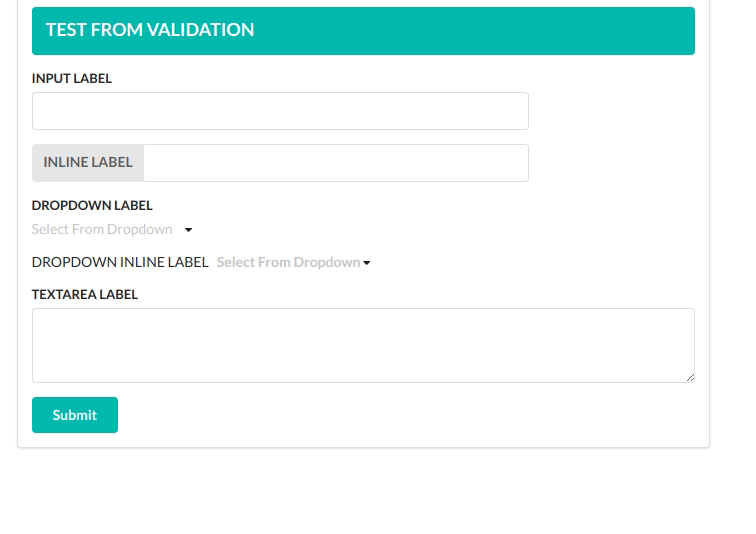
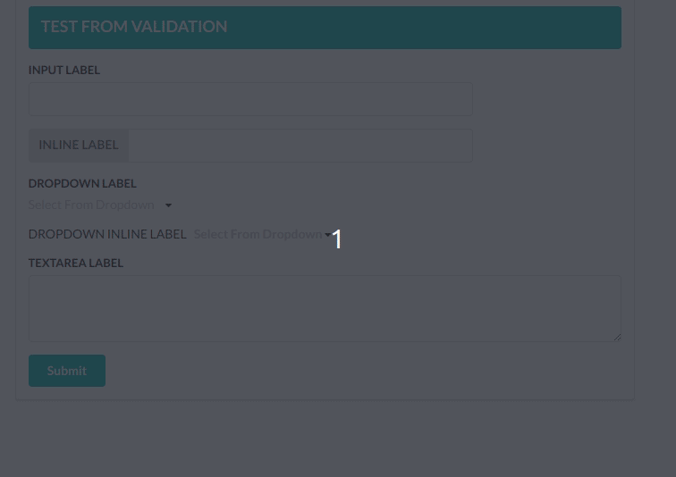

# semantic-ui-react-form-validator

> A semantic-ui implementation of react-form-validator-core

[](https://www.npmjs.com/package/semantic-ui-react-form-validator) [](https://standardjs.com)

## Install

```bash
npm install --save semantic-ui-react-form-validator
```
## Index
- [Input](#input)
- [Dropdown](#dropdown)
- [TextArea](#textarea)
- [Validation Rules](#validation-rules)
- [Add Custom Validation](#add-custom-validation)


## Input
First Lets look at the simple input field validation.
Note: You can use the *inline* props to get the inline label.
### Usage
```jsx
import React, { Component } from 'react'
import 'semantic-ui-css/semantic.css'; //Import the css only once in your project
import {Form,Input} from 'semantic-ui-react-form-validator'
import {Button} from 'semantic-ui-react';
class App extends Component {
  render () {
    return (
      <Form 
      ref="form"
      onSubmit={this.onSubmit} 
      >
        <Input 
          type="text"
          label="Test Input"
          onChange={(e)=>{this.setState({value:e.target.value})}} 
          value={this.state.value} 
          validators={['required']} 
          errorMessages={['this field is required']} 
          width={6} 
          />
          
        <Button color="teal">Submit<Button>
      </From>
    )
  }
}
```
### Result


##### Here is a list of all props you can use in the *Input* Component.

| Props | Required | Type | Default value | Description |
| ---- | -------- | ---- | ------------- | ----------- |
| type | true | ```string``` | text | Basic html input type |
| placeholder | false | ```string``` | | Basic html placeholder |
| label | false | ```string``` | | label |
| inline | false | ```bool``` | | Set it true to get inline labels |
| validators | false | ```array``` | | Array of validators. See list of default validators above.Leave empty for no validations |
| errorMessages | false | ```array``` | | Array of error messages. Order of messages should be the same as validators prop. |
| onChange | true | ```func``` | | *onChange* function is required to set the value of the input filed |
| value | true | ```string``` | empty String | You need to set the value of the input field in *onChange* function and pass the value as a prop to the *Input* Component.The validator looks for this value. |
| width | false | ```int``` | 12 | width of the input field. 12 means it will match the parent width |
## Dropdown
*Dropdown* Component is pretty similar to the *Input* Component.
### Usage
```jsx
import React, { Component } from 'react'
import 'semantic-ui-css/semantic.css'; //Import the css only once in your project
import {Form,Dropdown} from 'semantic-ui-react-form-validator'
import {Button} from 'semantic-ui-react';
class App extends Component {
  render () {
  const options=[
      {
        key: 'Jenny Hess',
        text: 'Jenny Hess',
        value: 'Jenny Hess',
        image: { avatar: true, src: '/images/avatar/small/jenny.jpg' },
      },
      {
        key: 'Elliot Fu',
        text: 'Elliot Fu',
        value: 'Elliot Fu',
        image: { avatar: true, src: '/images/avatar/small/elliot.jpg' },
      },
      {
        key: 'Stevie Feliciano',
        text: 'Stevie Feliciano',
        value: 'Stevie Feliciano',
        image: { avatar: true, src: '/images/avatar/small/stevie.jpg' },
      },
      {
        key: 'Christian',
        text: 'Christian',
        value: 'Christian',
        image: { avatar: true, src: '/images/avatar/small/christian.jpg' },
      },
      {
        key: 'Matt',
        text: 'Matt',
        value: 'Matt',
        image: { avatar: true, src: '/images/avatar/small/matt.jpg' },
      },
      {
        key: 'Justen Kitsune',
        text: 'Justen Kitsune',
        value: 'Justen Kitsune',
        image: { avatar: true, src: '/images/avatar/small/justen.jpg' },
      },
    ];
    return (
      <Form 
      ref="form"
      onSubmit={this.onSubmit} 
      >
        <Dropdown
          label="Test Dropdown"
          onChange={(e,{value})=>{this.setState({dropdown:value})}} 
          value={this.state.dropdown} 
          validators={['required']} 
          errorMessages={['this field is required']} 
          validators={['required']}
          errorMessages={['You must select one option']}
          options={options}
          />
          
        <Button color="teal">Submit<Button>
      </From>
    )
  }
}
```
## Result 


##### Here is a list of all props you can use in the *Dropdown* Component.

| Props | Required | Type | Default value | Description |
| ---- | -------- | ---- | ------------- | ----------- |
| placeholder | false | ```string``` | | Basic html placeholder |
| label | false | ```string``` | | label |
| inline | false | ```bool``` | | Set it true to get inline labels |
| validators | false | ```array``` | | Array of validators. See list of default validators above.Leave empty for no validations |
| errorMessages | false | ```array``` | | Array of error messages. Order of messages should be the same as validators prop. |
| onChange | true | ```func``` | | *onChange* function is required to set the value of the input filed ``` onChange=(e,{value})=>{ //handle value} ``` |
| value | true | ```string``` | | You need to set the value of the input field in *onChange* function and pass the value as a prop to the *Input* Component.The validator looks for this value. |
| options | true | ```array``` | | A list of options as an array. eg:- ``` [{key:1,text:"foo",value:1},{key:2,text:"bar",value:2}] ```
| multiple | false | ```bool``` | | Set it ```true``` to select more than one options |
| selection | false |``` bool``` | | Set it ```true``` to make the dropdown look like select field |
| search | false |``` bool``` | | You'll be able to search from dropdown options when set to ```true```|
| width | false | ```int``` | 12 | width of the input field. 12 means it will match the parent width |

## TextArea 
### Usage
```jsx
import React, { Component } from 'react'
import 'semantic-ui-css/semantic.css'; //Import the css only once in your project
import {Form,TextArea} from 'semantic-ui-react-form-validator'
import {Button} from 'semantic-ui-react';
class App extends Component {
  render () {
    return (
      <Form 
      ref="form"
      onSubmit={this.onSubmit} 
      >
        <TextArea
          label="TEXTAREA LABEL"
          validators={['required']}
          errorMessages={['CAnnot Be empty']}
          value={this.state.txtValue}
          onChange={e=>{this.setState({txtValue:e.target.value})}}
          />
          
        <Button color="teal">Submit<Button>
      </From>
    )
  }
}
```
##### Here is a list of all props you can use in the *Dropdown* Component.
| Props | Required | Type | Default value | Description |
| ---- | -------- | ---- | ------------- | ----------- |
| placeholder | false | ```string``` | | Basic html placeholder |
| label | false | ```string``` | | label |
| validators | false | ```array``` | | Array of validators. See list of default validators above.Leave empty for no validations |
| errorMessages | false | ```array``` | | Array of error messages. Order of messages should be the same as validators prop. |
| onChange | true | ```func``` | | *onChange* function is required to set the value of the input filed |
| value | true | ```string``` | empty String | You need to set the value of the input field in *onChange* function and pass the value as a prop to the *Input* Component.The validator looks for this value. |

## Validation Rules

Simple form validation component for react forms inspired by [formsy-react](https://github.com/christianalfoni/formsy-react)

Default validation rules:
+ matchRegexp
+ isEmail
+ isEmpty
+ required
+ trim
+ isNumber
+ isFloat
+ isPositive
+ minNumber
+ maxNumber
+ minFloat
+ maxFloat
+ minStringLength
+ maxStringLength
+ isString
+ maxFileSize
+ allowedExtensions

Some rules can accept extra parameter, example:
````javascript
<Input
   {...someProps}
   validators={['minNumber:0', 'maxNumber:255', 'matchRegexp:^[0-9]$']}
/>
````
## Add Custom Validation
#### You can add your own rules
````javascript
componentDidMount(){
    Form.addValidationRule('isFoo',value=>{
      var foo=/foo/;
      return foo.test(value)
    })
  }
````
#### check out app.js in example folder for more examples
## Form
+ Props

| Prop            | Required | Type     | Default value | Description                                                                                                                  |
|-----------------|----------|----------|---------------|------------------------------------------------------------------------------------------------------------------------------|
| onSubmit        | true     | function |               | Callback for form that fires when all validations are passed                                                                 |
| instantValidate | false    | bool     | true          | If true, form will be validated after each field change. If false, form will be validated only after clicking submit button. |
| onError         | false    | function |               | Callback for form that fires when some of validations are not passed. It will return array of elements which not valid. |
| debounceTime    | false    | number   | 0             | Debounce time for validation i.e. your validation will run after `debounceTime` ms when you stop changing your input |

## License

MIT © [Aman9804](https://github.com/Aman9804)
